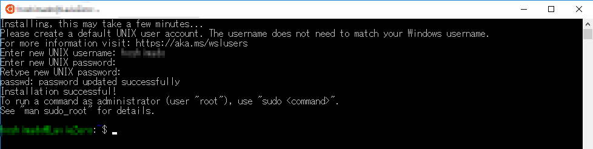
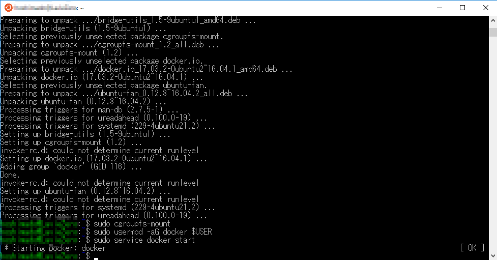
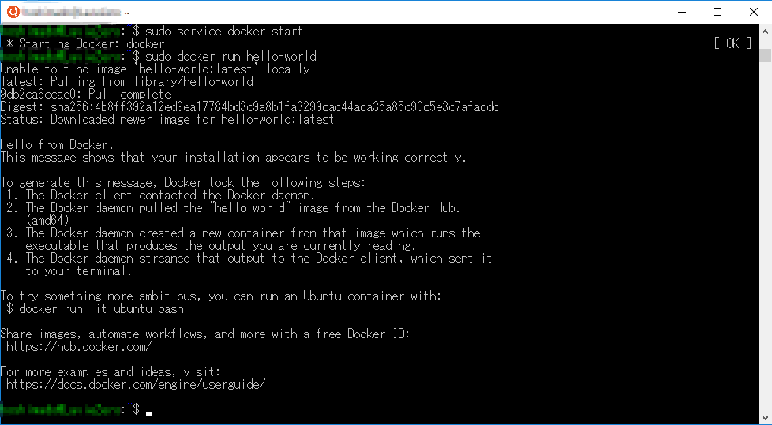
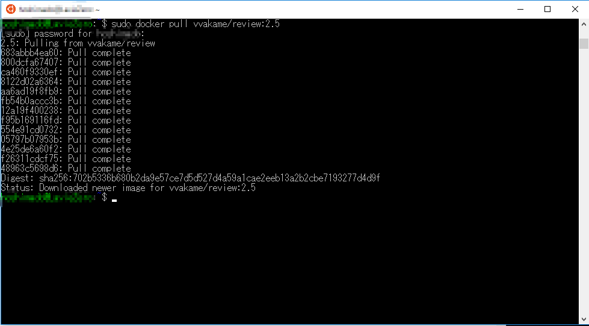
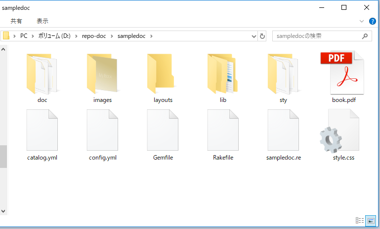

# WindowsでDocker+Re:VIEWを使う

本ドキュメントでは、Windows 10上で「Windows Subsystem for Linux」と「Re:VIEW image for Docker」を利用し、Re:VIEWドキュメントからPDFおよびEPUBを生成する方法を紹介します。Dockerコンテナを利用することで、reviwe動作環境を容易に構築できます。

Windows 10以前の環境では、「LatexとRuby、そしてReivewを直接Windows上にインストールする」方法をお勧めします。こちらの方法についてはGoogleにて「Windows Latex Ruby Review」のキーワードで検索すると、良記事が見つかると思います（2018年1月以降の記事をお勧めします）。

## 必要なもの
* **Microsoft Windows**。
  * 本ドキュメントはWindows 10 **Home**エディション（Hyper-V無し）に基づいています。
  * Windows 10 April Update 2018（10.0.17134）以降の環境と対象とします。
* **ストレージ内に最低でも3.5GB以上の空き領域**。
  * Windows Subsystem for Linuxをインストールするのと1.10GB使用します。
  * Re:VIEW image for Dockerをインストールすると2.03GBを使用します(Re:VIEW 2.5での例)。
  * このほかにドキュメント自体などを収納するための空き領域も必要です。
* **UTF-8を扱うことのできるテキストエディタ**。
  * 「メモ帳」アプリでもUTF-8形式での保存は可能ですが、実際にドキュメントを執筆・編集するにあたってはより適切で高機能なテキストエディタが必要になるでしょう。Visual Studio Code、Atom、Emacs、秀丸など向けにRe:VIEWをサポートする外部拡張が公開されています（[https://github.com/kmuto/review/wiki](https://github.com/kmuto/review/wiki)）。

## 動作時の負荷について

* WSL利用時のメモリ利用量は0.1GB程度です。

## 完了まで全体像

以下の操作を行います。ネットワーク回線の速度に依存しますが、10～30Mbpsの下り速度の環境で「1.」を30分くらい、「2.」と「3.」を30分くらい、合計１ｈと少しで完了できます。

1. Windows Subsystem for Linux (Ubuntu)のセットアップ
2. Docker のセットアップ
3. Re:VIEW image for Dockerの取得

# 環境の構築方法

## Windows Subsystem for Linux のセットアップ

Windows 10 April Update 2018の適用環境で、**Windows Subsystem for Linux**（以下、WSLと呼称）をインストールするには以下の操作を行います。この操作は、ネットワーク回線速度に依存しますが、10～30Mbpsの環境で **30分程度**で完了できます。

### WSLのインストール

1. スタートメニューの「設定」から「アプリと機能」を開く。
2. 下の方へスクロールして「関連設定」の「プログラムと機能」を開く。
3. 「Windowsの機能の有効化または無効化」を開く。
4. 「Windows Subsystem for Linux」にチェックを入れる。
5. WSLのインストールが始まるので、終了したら「今すぐ再起動」をクリックして再起動する。

※WSLの有効化自体はすぐ終わります。再起動時の追加処理もほぼありません。

### Ubuntu 16.04のインストール

WSL環境の上で実際に動作するLinuxディストリビューションアプリとして、「Ubuntu 16.04」をインストールします。具体的には以下の操作を行います。

1. 再起動後、スタートメニューから「Microsoft Store」を選択し、検索ボックスに「Ubuntu」を入力して「Ubuntu 16.04」を選択する。
2. 「入手」ボタンをクリックして（ダウンロード＆）インストールする。
3. インストールが完了すると、初期設定としてユーザー名とパスワードを聞いてくるので、Linux（Ubuntu）上で利用するユーザー名とパスワードを入力する。
4. 初期設定が完了すると、Ubuntu on WSLのコマンドプロンプト（ターミナル）が表示される。


以上で、Docker for UbuntuをインストールするためのWSL（Ubuntu on WSL）側のセットアップが完了しました。


## Dockerのセットアップ

Ubuntu on WSL環境に対して、以下の手順でDocker for Ubuntu をインストールします。

Ubuntu on WSLを管理者権限で起動します。開いたUbunutのコマンドライン上から以下のコマンドを実行します。初回のsudo実行時は、パスワードを要求されるので、先ほどの「Ubuntuの初期設定」で設定したパスワード入れます。

```
sudo apt update
sudo apt upgrade
sudo apt install docker.io
sudo cgroupfs-mount
sudo usermod -aG docker $USER
sudo service docker start
```


dockerがインストールされ、デーモン (daemon)が起動します。本設定は初回のみ実施し、2回目以降は必要ありません。2回目以降の動作に準拠するため、一旦「exit」でUbuntu on WSLを終了します。

2回目以降は、以下の操作でDockerデーモンを起動します。
1. Ubuntu on WSLを管理者権限で起動する。
2. Ubuntuのコマンドライン（ターミナル）上で、以下のコマンド実行する。

```
sudo cgroupfs-mount && sudo service docker start
```

dockder が正しくセットアップされたの確認のため、Hello Worldのイメージを起動してみます。

```
sudo docker run hello-world
```



「Hello from Docker!」が表示されれば成功です。


## Re:VIEW image for Dockerのダウンロードと展開

Re:VIEW image for Dockerの取得します。ここでは「review 2.5」を例にコマンドを例示します。上述の「Ubuntu on WSL上でDockerデーモンを起動した」状態で、以下のコマンドを実行します。

```sh
shdo docker pull vvakame/review:2.5
```

イメージのダウンロードが終わるのを待ちます。




ダウンロードが終わりましたら、以下のコマンドを実行して、Reviewのバージョンを表示します。

```sh
sudo docker run --rm vvakame/review:2.5 /bin/sh -c "review version"
```

「2.5.0」が表示されれば、Re:VIEW image for Dockerの取得と動作確認は完了です。

# Docker+Re:VIEWドキュメント制作

WSL+Docker+Re:VIEW環境でのドキュメント（pdf）作成方法を紹介します。
以下では、ドキュメントをDドライブ直下の「repo-doc」フォルダに格納すると仮定して記載します（ `D:\repo-doc\` ）。

コマンド操作は、Ubuntu on WSLのコマンドライン（コンソール）上から行ってください。Ubuntu on WSLは通常起動で構いません（管理者権限**不要**）。なお、Windowsを再起動した際は、一度だけ**管理者権限で**Ubuntu on WSLを起動し、 `sudo cgroupfs-mount && sudo service docker start` を実行して「Dockerデーモン」を起動しておいてください。その後、管理者権限で起動したコマンドラインは閉じてしまって構いません。

## reviewコマンドによるpdfファイル生成

以下の操作を行う方法を、紹介します。

1. ドキュメント格納フォルダ「repo-doc」配下に、「sampledoc」フォルダを作成し、その中にreviewテンプレートファイルを生成する。
2. reviewテンプレートファイルから、pdfファイルを生成する。

Dドライブのルートに「repo-doc」フォルダを作成した状態で、以下を実行してください(※Windows側のドライブは、WSL上からは「/mnt/」配下に参照できます。Dドライブのルートは `/mnt/d` になります)。

```
$ sudo docker run -v /mnt/d/repo-doc:/work -it vvakame/review:2.5 /bin/sh
# cd /work
# review-init sampledoc
# cd sampledoc
# review-pdfmaker config.yml
# exit
$ exit
```

ここで、「$」マークの行はWSL上のコマンドラインを意味します。「#」マークの行は、docker上のコマンドラインを意味します（※実行時には、「＄」も「＃」も入力しません）。

コマンド「`sudo docker run -v /mnt/d/repo-doc:/work -it vvakame/review:2.5 /bin/sh`」は、以下の処理をしています。

1. 「Re:VIEW image for Docker」を起動する。
2. Windows側のDドライブのルートの「repo-doc」フォルダを、docker側のルートの「work」フォルダとしてマウントする。
3. Dockerのコマンドラインに入る。

※Dockerのコマンドラインも、WSLのコマンドラインも、「exit」コマンドで抜けることができます。

エクスプローラーなどでWindows上のDドライブのルートにある「repo-doc」フォルダを見ると、以下のようになっています。



このフォルダ内の各ファイルの詳細は、[Re:VIEW Quick Start Guide](https://github.com/kmuto/review/blob/master/doc/quickstart.ja.md)や[Re:VIEW Format Guide](https://github.com/kmuto/review/blob/master/doc/format.ja.md)、その他[https://github.com/kmuto/review/wiki](https://github.com/kmuto/review/wiki)にある各ドキュメントを参照してください。

上記のコマンド実行により、「sampledoc」というフォルダが作成され、フォルダ内に「book.pdf」ファイルが生成されていることを確認してください。このpdfファイルが、「sampledoc」のReviewドキュメントから作成されたpdfです。

[Acrobat Reader](https://get.adobe.com/jp/reader/)でPDFを開いてみます。


続いて編集操作を行ってみます。コンテンツを書き込むメインファイルである「sampledoc.re」を、テキストエディタを利用して適当なテキストを書き込み、上書き保存してください。


Ubuntu on WSLのコマンドライン上で、今度は以下を実行してください。なお、先ほどの book.pdf ファイルを開いている場合は、閉じてから実行してください。

```
$ sudo docker run -v /mnt/d/repo-doc:/work -it vvakame/review:2.5 /bin/sh
# cd /work/sampledoc
# review-pdfmaker config.yml
# exit
$ exit
```

変更した「sampledoc.re」ファイルにしたがって、「book.pdf」が再生成されていることを確認してください。

なお、exitコマンドでdockerのコマンドラインから抜けずに、続けて各種 reviewコマンドを実行することも可能です。

## reviewコマンドによるEPUBファイル生成

EPUBを生成するには、「pefmaker」の代わりに「epubmaker」を用いるだけです。具体的には以下のコマンドを実行します。

```
$ sudo docker run -v /mnt/d/repo-doc:/work -it vvakame/review:2.5 /bin/sh
# cd /work/sampledoc
# review-epubmaker config.yml
# exit
$ exit
```

book.epubというEPUBファイルが生成されるので、Google Chromeブラウザの拡張機能である[Readium](http://readium.org/)でこのファイルを開いてみます（※単純にファイルをダブルクリックして、Microsoft Edge ブラウザで開くこともできます）


このように、同じコンテンツからPDFとEPUBという2つの形式のファイルを作成できました！

## 普段のReviewコンパイルについて

### 起動時にDockerデーモンを起動しておく

「Dockerデーモン」の起動は、Windowsの起動毎に実行する必要があります。一度起動すると、次にWindowsをシャットダウンするまでは動き続けてくれます(正確には、ログイン後に1度。ログオフするまで有効。サインアウトしてサインインする＝セッションとしてはログインしたままの操作の範囲では、Dockerデーモンは起動し続けてくれます）。

「Dockerデーモン」の起動方法は先に記載の通りで、以下となります。起動したら、WSLの画面は閉じてしまって構いません。

1. Ubuntu on WSLを**管理者権限で**起動する。
2. Ubuntuのコマンドライン（ターミナル）上で、以下のコマンド実行する。

```
sudo cgroupfs-mount && sudo service docker start
```

### 容易なReviewのコンパイル実行方法

実際のWindows上での利用方法としては、以下のようになると思います。

1. 任意のエディタ（Visual Studio Codeとか）でReviewファイルを作成する。
2. 作成したReviewファイルを、**reviewコマンドでpdfへコンパイル**する。

一般的なreviewファイルは、以下の様なフォルダ構造で作成すると思います。

```
ドキュメントのフォルダ
　＋articles
　　＋実際のreview.reファイル
    ＋config.yml
    ＋catalog.yml
```

「2.」の「reviewコマンド」を実行する際には、Ubuntu on WSLを通常モードで起動します（**管理者権限は不要**、という意味です）。WSLコマンドライン（ターミナル）上で「ドキュメントのフォルダ」まで移動しておきます（`cd /mnt/d/～`）。「ls」コマンドで「articles」が見えている状態です。

この状態であれば、コンパイルの操作「`review-pdfmaker`」はWSL上から以下の**コマンド一行で実行**することができます。なお、WSLのコマンドラインでは**Bashシェルの補完機能（TABキーでのコマンド名やファイル名の補完など）を利用できます**。

```
sudo docker run --rm -v `pwd`/articles:/work vvakame/review:2.5 /bin/sh -c "cd /work && review-pdfmaker config.yml"
```

上記のコマンドは、以下を纏めて実行しています。

1. dockerイメージを起動（生成）：run
2. カレントフォルダの直下にあるarticlesフォルダを、docker上のルートのworkフォルダとしてマウント：-v
3. docker起動後に、「workフォルダへ移動、reviewコンパイル」を実行：/bin/sh -c
4. dockerイメージを終了（破棄）：-rm


以上で、**仮想マシンなどを立ち上げることなく、Windows上からreviewコマンドのpdfコンパイルを簡単に実行**できるようになります♪


## その他

### コマンドの詳細

dockerコマンドの詳細については[https://docs.docker.com/engine/reference/commandline/cli/](https://docs.docker.com/engine/reference/commandline/cli/)などを、参照してください。

reviewコマンドは、[https://github.com/kmuto/review/](https://github.com/kmuto/review/)などを、参照してください。

### Windows上で動作するDocekrについて

Windows上で動作するDocekr環境としては、2018年7月現在、以下の3方式が存在します。

* [Docker for Windows](https://docker.com/docker-windows)
  * Dockerの開発元であるDocker, Inc.社公式の実装。Hyper-V必須。
  * 動作は高速だが、Hyper-V利用のためWindows 8以降でかつProfessional以上のエディションが必須。

* [Docker Toolbox](https://docker.com/products/docker-toolbox)
  * Docker, Inc.社公式の実装。
  * VirtualBox利用のためWindows7でも動作するが、オーバーヘッドが大きい仮想化ソフトウェア上での動作となる。

* Docker for Ubuntu + [Ubuntu 16.04](https://www.microsoft.com/ja-jp/p/ubuntu-1604/9pjn388hp8c9) on Windows Subsystem for Linux
  * Docker for Ubuntuは、Docekr, Inc.社公式の実装。
  * Ubuntu 16.04は「Microsoft Store」で配布されているUbuntu公式のディストリビューション。
  * Windows 10 April Update 2018（10.0.17134）のWSLにて、Dockerデーモンが動作するようになったので、利用可能となった（正確には、Build 17046以降）。
  * Hyper-Vが不要のためHomeエディションでも動作可。
  * 仮想ソフトウェアも不要のため、動作が軽い。
  * WSL必須のため、Windows 10環境のみでの動作。

本ドキュメントで紹介した方式は、3つ目のものとなります。2つ目のものについては、[こちら](windows-review.md)を参照ください。

